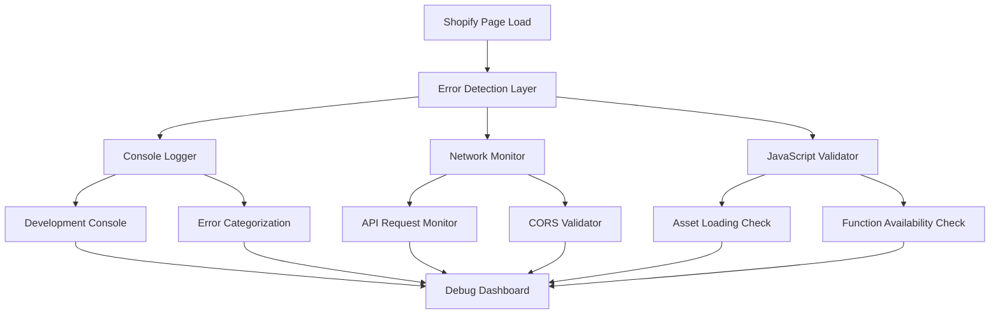
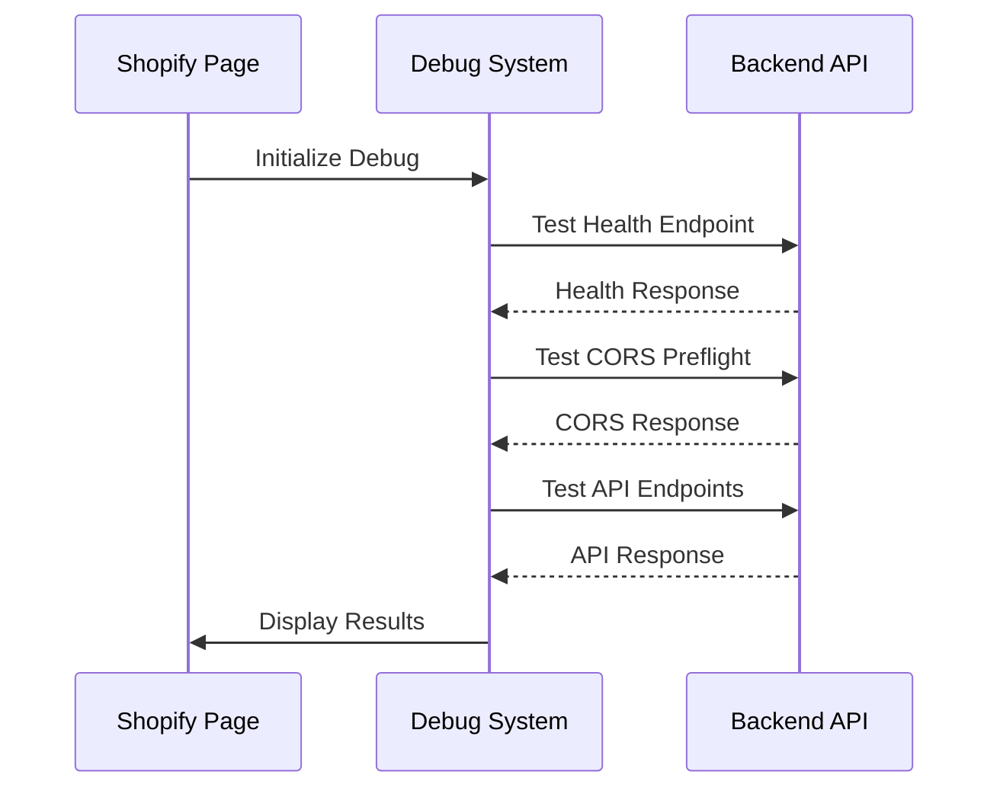
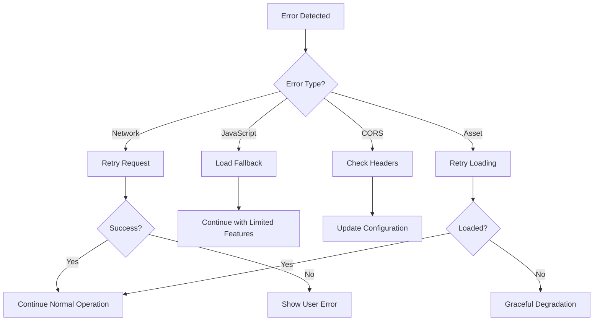

# Frontend Error Debugging Design

## Overview

This design outlines a comprehensive approach to identify, debug, and fix frontend JavaScript errors in the Shopify-based map printing application. The solution focuses on systematic error detection, improved logging, and robust error recovery mechanisms while maintaining a good user experience.

## Architecture

### Error Detection and Logging System



### Frontend Connectivity Validation



## Components and Interfaces

### 1. Enhanced Error Detection Layer

**Purpose:** Capture and categorize all frontend errors with detailed context.

**Key Features:**
- Global error handlers for uncaught exceptions
- Promise rejection handlers
- Network request monitoring
- Asset loading validation

**Interface:**
```javascript
class ErrorDetectionLayer {
  constructor(config) {
    this.debugMode = config.debugMode;
    this.errorCategories = ['network', 'javascript', 'cors', 'asset'];
  }
  
  captureError(error, category, context) {
    // Capture and categorize errors
  }
  
  setupGlobalHandlers() {
    // Set up window.onerror, unhandledrejection handlers
  }
}
```

### 2. Enhanced Debug System

**Purpose:** Provide comprehensive connectivity and functionality testing.

**Key Features:**
- Backend connectivity tests
- CORS validation
- API endpoint testing
- JavaScript function availability checks

**Interface:**
```javascript
class EnhancedDebugSystem {
  async runDiagnostics() {
    const results = {
      connectivity: await this.testConnectivity(),
      cors: await this.testCORS(),
      javascript: await this.testJavaScript(),
      assets: await this.testAssets()
    };
    return results;
  }
}
```

### 3. Robust API Client

**Purpose:** Handle API requests with proper error handling and retry logic.

**Key Features:**
- Automatic retry with exponential backoff
- Detailed error logging
- CORS header management
- Token handling

**Interface:**
```javascript
class RobustApiClient extends StravaApiClient {
  constructor(config) {
    super(config);
    this.retryConfig = {
      maxRetries: 3,
      baseDelay: 1000,
      maxDelay: 10000
    };
  }
  
  async apiRequestWithRetry(endpoint, options) {
    // Implement retry logic with exponential backoff
  }
}
```

### 4. Asset Loading Validator

**Purpose:** Ensure all required JavaScript and CSS assets load properly.

**Key Features:**
- Check for 404 errors on asset loading
- Validate JavaScript execution
- Verify CSS application

**Interface:**
```javascript
class AssetValidator {
  async validateAssets() {
    const assets = [
      'strava-integration.js',
      'mapbox-integration.js',
      'strava-pages.css'
    ];
    
    return await Promise.all(
      assets.map(asset => this.checkAsset(asset))
    );
  }
}
```

## Data Models

### Error Report Model
```javascript
const ErrorReport = {
  id: 'string',
  timestamp: 'ISO8601',
  category: 'network|javascript|cors|asset',
  severity: 'warning|error|critical',
  message: 'string',
  context: {
    url: 'string',
    userAgent: 'string',
    stackTrace: 'string',
    requestDetails: 'object'
  },
  resolved: 'boolean'
};
```

### Diagnostic Result Model
```javascript
const DiagnosticResult = {
  testName: 'string',
  status: 'passed|failed|warning',
  message: 'string',
  details: 'object',
  timestamp: 'ISO8601',
  duration: 'number'
};
```

## Error Handling

### Error Categories and Responses

1. **Network Errors**
   - Retry with exponential backoff
   - Display "Connection issue" message to user
   - Log detailed network information

2. **CORS Errors**
   - Check origin configuration
   - Validate headers
   - Provide specific CORS troubleshooting

3. **JavaScript Errors**
   - Prevent page crash
   - Load fallback functionality
   - Log stack traces

4. **Asset Loading Errors**
   - Retry asset loading
   - Use CDN fallbacks where possible
   - Graceful degradation

### Error Recovery Strategies



## Testing Strategy

### 1. Automated Error Detection Tests
- Simulate network failures
- Test CORS configurations
- Validate JavaScript loading
- Check asset availability

### 2. Cross-Browser Compatibility Tests
- Chrome, Safari, Firefox, Edge testing
- Mobile browser testing
- Different network conditions

### 3. Integration Tests
- End-to-end Shopify page testing
- Backend API integration testing
- Authentication flow testing

### 4. Performance Tests
- Error handling performance impact
- Debug system overhead measurement
- Asset loading optimization

## Implementation Approach

### Phase 1: Enhanced Error Detection
1. Implement global error handlers
2. Add detailed logging system
3. Create error categorization
4. Set up console debugging tools

### Phase 2: Robust API Communication
1. Enhance existing API client with retry logic
2. Improve CORS handling
3. Add request/response logging
4. Implement token refresh handling

### Phase 3: Asset and JavaScript Validation
1. Create asset loading validator
2. Add JavaScript execution checks
3. Implement fallback mechanisms
4. Add graceful degradation

### Phase 4: User Experience Improvements
1. Add user-friendly error messages
2. Implement loading states
3. Create error recovery UI
4. Add help documentation

## Security Considerations

- Ensure error logs don't expose sensitive data
- Validate all user inputs in error handlers
- Sanitize error messages displayed to users
- Implement rate limiting for error reporting

## Performance Considerations

- Minimize overhead of error detection
- Use efficient logging mechanisms
- Implement lazy loading for debug tools
- Optimize retry logic to avoid excessive requests